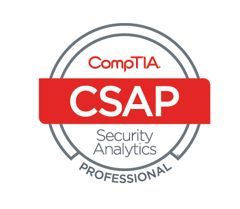

# Certifications & Skills

---

## Certifications

  

    
    
<strong>CompTIA Cybersecurity Analyst+ (CySA+)</strong>

  

  
  

    
    
<strong>CompTIA Security+</strong>

  

  

    
    
<strong>CompTIA Security Analytics Professional (CSAP)</strong>

  

  
  

    
    
<strong>INE Security Certified Junior Penetration Tester (eJPT)</strong>

  

  

    
    
<strong>Certified Blue Team Level 1 (BTL1)</strong>

  

  

    
    
<strong>Cisco Certified Network Associate (CCNA)</strong>

  

 

    
    
<strong>INE Certified Cloud Associate (ICCA)</strong>

  

  

    
    
<strong>ISC2 Certified in Cybersecurity (CC)</strong>

  

  

    
    
<strong>Certified Network Security Practitioner (CNSP)</strong>

  

  

    
    
<strong>Microsoft Certified: Azure Fundamentals (AZ-900)</strong>

  

  

    
    
<strong>Google Cybersecurity Professional</strong>

  

---

## Skills

### Security Tools and Technologies
- **Red Teaming:** Burp Suite, Metasploit, Malware Development (for research purposes)
- **Blue Teaming:** Wireshark, Nmap, OSSEC, Splunk, ELK, Microsoft 365 Defender, Purview
- **Endpoint and Network Security:** EDR, IAM, XDR, SIEM, DLP, NAC, and MDM tools

### Programming and Development
- **Languages:** Python, JavaScript, Bash, HTML/CSS
- **Cloud Security:** Microsoft Azure
- **Containerization and Virtualization:** Docker, VMware

### Frameworks and Compliance
- **Security Frameworks:** NIST, ISO 27001/27002, CIS, MITRE ATT&CK
- **Regulations:** GDPR, HIPAA, PCI DSS Compliance

[Back to About Me](./index.md)
